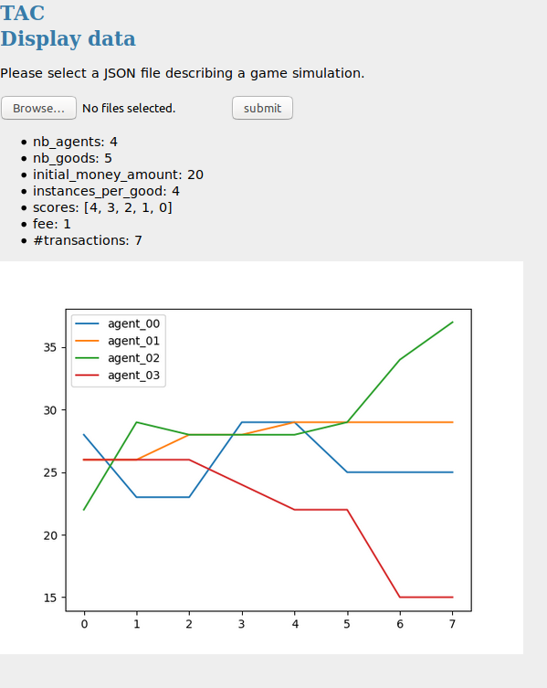

## GUIs		

This package contains GUI tools to interact with the TAC project (e.g. data visualization).		

### Tools		

- Load a JSON file describing a game simulation 		
(like the one described in [this section](../../examples/simulation_demo#other-parameters)) and		
show some details:		

    python display_data.py		

- Screenshot:		

  